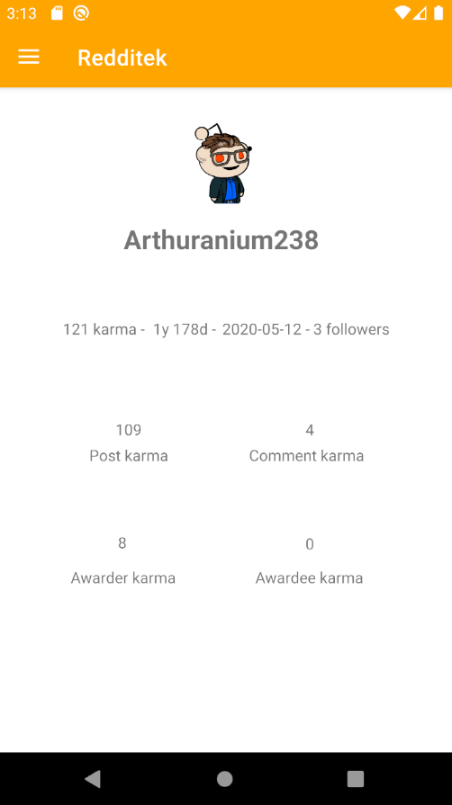

# Redditech

The Redditech project is a reddit client created using Kotlin and Reddit API.
You will be able to :
- Authenticate to you Reddit account using OAuth 2.0
- View your feed and sort it by category (best, top, hot, ...)
- Access your profile information and settings 
- Log out
- Search a subreddit and view its information
- Follow / Unfollow a subreddit
- Access subreddit posts any sort them by category (best, top, hot, ...)

## Technical informations

### How to use this repository

To use this code you need to get access to the Reddit API.
First, create a [reddit app](https://www.reddit.com/prefs/apps/) so you can get a client ID and a client secret.
Then put your values here:
- In `app/src/main/java/com/example/redditek/MainActivity.kt` at line 97 & 98 add your client id and your client secret.
- In `app/src/main/java/com/example/redditek/AuthenticationActivity.kt` at line 25 add your client id and your redirect uri. At line 106 add your client secret.

### Development

This app was developed in Kotlin using Android studio. The graphical elements are provided by the Material Theme.

Some dependencies were added for specific actions:
- com.squareup.picasso:picasso:2.71828              - display images
- de.hdodenhof:circleimageview:3.1.0                - display profile picture
- com.github.bumptech.glide:glide:4.11.0            - display videos and gifs
- com.squareup.okhttp3:okhttp:4.2.1'                - get basic network elements
- com.squareup.retrofit2:retrofit:2.9.0             - make http requests
- com.squareup.retrofit2:converter-gson:2.4.0'      - create and parse json easily 

#### Reddit API

The reddit API is used to get information about the user, his settings, feed, subreddits and settings.

To get information that doesn't require user authentication ww.reddit.com is used. For information that are user-dependant oauth.reddit.com is used.
Our client uses Reddit api OAuth 2.0 code flow method to process authentication and get a bearer token and a refresh token.

## User Documentation

### Feed

The feed is the main place of the application. Here you can find posts from the subreddits you are following. To sort them use the 3 buttons at the top of the screen.
If you find a post interesting and you want to see similar posts you can click on it to access the subreddit's page.

### Search

The search bar is placed at the top of the main screen, your feed.
It allows you to search a subreddit by name.
Results with a similar name will be displayed. Click on a result to access the subreddit's page.

### Subreddit page

When you search a subreddit or if you click a on a post in your feed you will be taken here.
At the top you will see a header with the subreddit name, title, description, icon, banner, and number of followers. You can follow or unfollow the subreddit using the button.  
Below the header subreddit posts will be displayed. You can sort them using the 3 buttons at the top of the screen.

### Profile page

The profile page will display your account information such as:

- Karma by type
- Reddit age
- Account creation date
- Username
- Profile picture

### Settings page

There is a settings page to manage your preferences.
You can edit a variety of settings sur as:

- Turn on / off recommendations based on your location
- Turn on / off NSFW (Not Safe For Work) posts in your feed
- Turn on / off +18 content in search results
- Turn on / off email notifications when you receive a private message
- Turn on / off email notifications when someone replies to your posts
- Turn on / off all email notifications

